The most updated list of my publications is available at <u><a href="https://scholar.google.pl/citations?user=DMmIVeoAAAAJ&hl=en">my Google Scholar profile</a>.</u>

If you do not have access to these articles, just drop me an e-mail, I will be happy to provide you a copy of the manuscript.

  

   <a  href="https://doi.org/10.26434/chemrxiv-2025-4m2l5">
     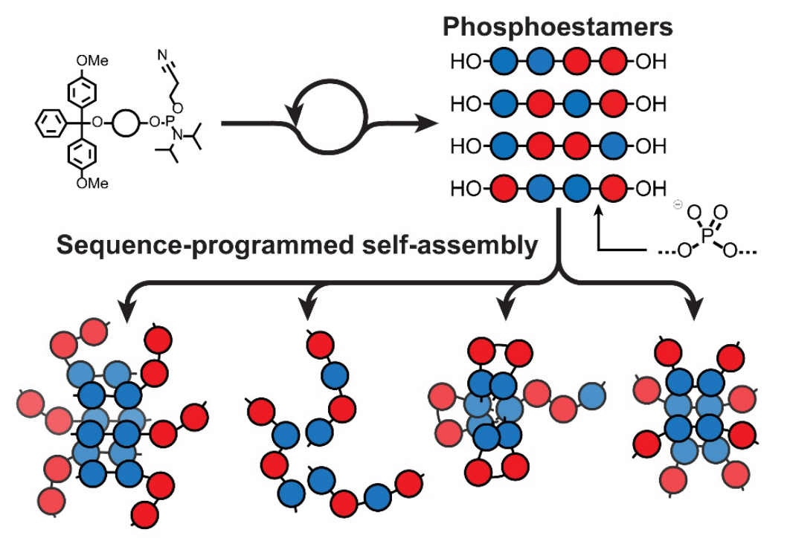
   </a>
   

    
<b>18. Differential Self-Assembly of Sequence-Isomeric Phosphoestamers</b>

    
J. Williamson, <u>T.K. Piskorz,</u>  B. Claringbold, A. Paul, N. Harvey, F. Duarte, C. J. Serpell

    

      <a href="https://doi.org/10.26434/chemrxiv-2025-4m2l5">(Preprint)</a>
    

   

  

  

   <a  href="https://doi.org/10.1002/anie.202524427">
     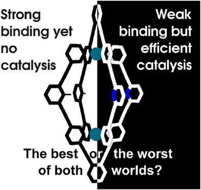
   </a>
   

    
17. Breaking Metal-Organic Cage Symmetry Enhances Diels–Alder Catalytic Specificity and Proficiency

    
A. Maheshwari, <u>T.K. Piskorz</u>, P. Boaler, F. Duarte, P. Lusby

    

      <a href="https://doi.org/10.1002/anie.202524427">Angew. Chem. Int. Ed. <b>2026</b></a>
    

   

  

  

  

   <a  href="https://doi.org/10.1021/jacs.5c01249">
     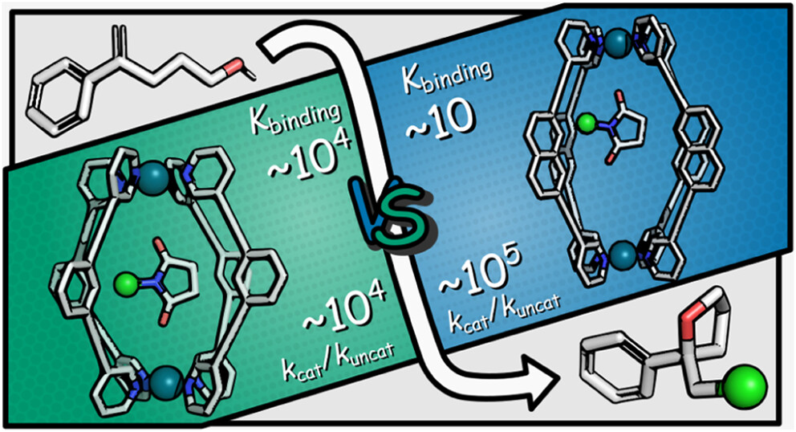
   </a>
   

    
16. Dissecting the Effects of Cage Structure in the Catalytic Activation of Imide Chloronium Ion Donors

    
H. Zhou,‡ <u> T.K. Piskorz,‡</u> K. Liu, Y. Lu, F. Duarte, P. Lusby

    

      <a href="https://doi.org/10.1021/jacs.5c01249">J. Am. Chem. Soc. 2025, 147, 13, 11456</a>
    

   

  

  

   <a  href="http://dx.doi.org/10.1039/D4FD00188E">
     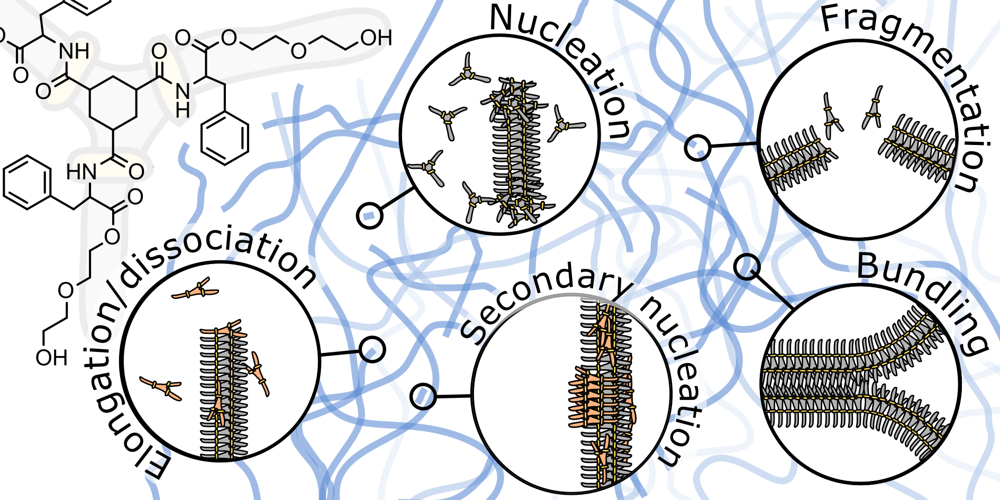
   </a>
   

    
15. Fiber formation seen through the high-resolution computational microscope

    
<u> T.K. Piskorz,*</u> V. Lakshminarayanan, A. H. de Vries, J. van Esch,* 

    

      <a href="http://dx.doi.org/10.1039/D4FD00188E">Faraday Discuss., 2025, 260, 269</a>
    

   

  

  

   <a  href="https://doi.org/10.1021/acs.jctc.4c00850">
     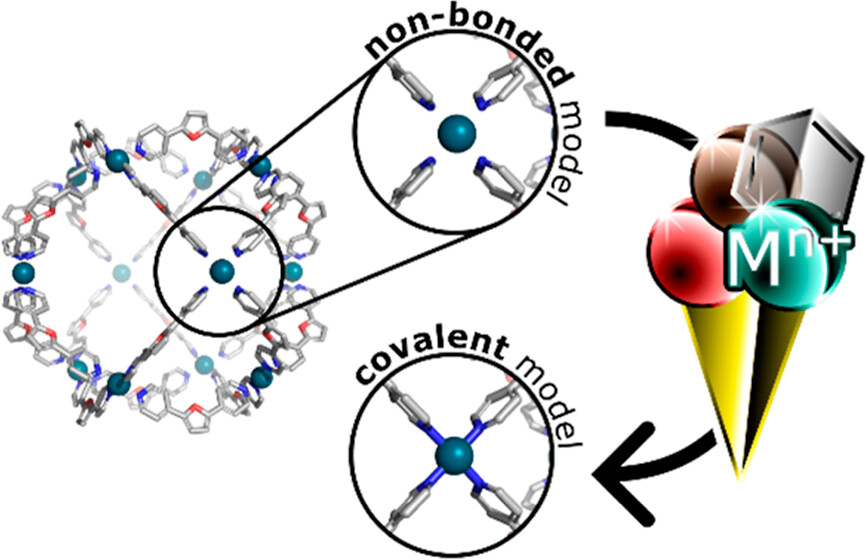
   </a>
   

    
14. metallicious: Automated force-field parametrization of covalently bound metals for supramolecular structures

    
<u> T.K. Piskorz</u>, B. Lee, S. Zhan, F. Duarte 

    

      <a href="https://doi.org/10.1021/acs.jctc.4c00850">J. Chem. Theory Comput., <b>2024</b>, 20, 20, 9060</a>
      <a href="https://doi.org/10.26434/chemrxiv-2024-383j5">(Preprint)</a>
    

   

  

  
  

   <a  href="https://doi.org/10.1021/acs.jcim.4c00355">
     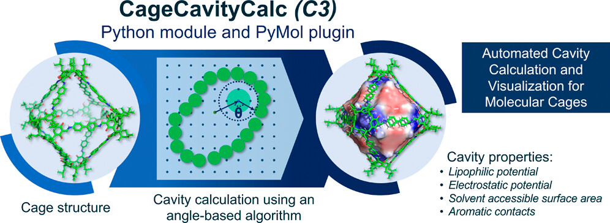
   </a>
   

    
13. CageCavityCalc (C3): A computational tool for calculating and visualizing cavities in Molecular Cages

    
V. Martí-Centelles, <u>T.K. Piskorz</u>, F. Duarte

    

      <a href="https://doi.org/10.1021/acs.jcim.4c00355">J. Chem. Inf. Model. <b>2024</b>, 64, 14, 5604.</a>
      <a href="https://doi.org/10.26434/chemrxiv-2024-fmlx0">(Preprint)</a>
    

   

  

  

   <a  href="https://doi.org/10.1021/jacs.4c05160">
     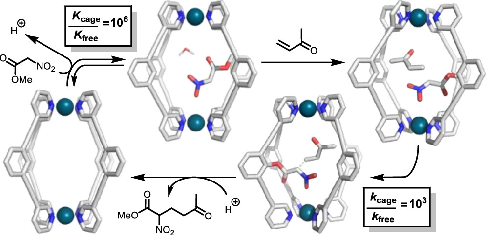
   </a>
   

    
12. Origins of High-Activity Cage-Catalyzed Michael Addition

    
P. J. Boaler, <u>T.K. Piskorz</u>, L. E. Bickerton, J. Wang, F. Duarte, G. C. Lloyd-Jones, P. J. Lusby

    

      <a href="https://doi.org/10.1021/jacs.4c05160">J. Am. Chem. Soc. <b>2024</b>, 146, 19317</a>
    

   

  

  
  

   <a  href="https://doi.org/10.1021/acsomega.4c02628">
     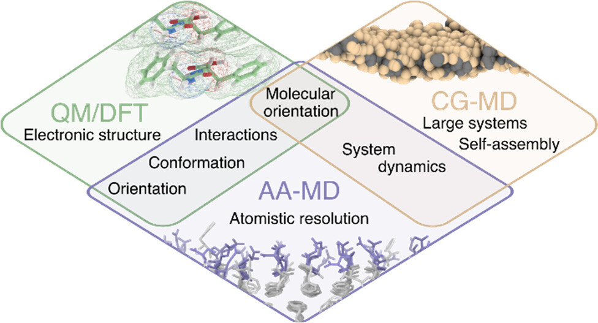
   </a>
   

    
11. Tips and Tricks in the Modeling of Supramolecular Peptide Assemblies

    
<u> T.K. Piskorz</u>,‡ L. Perez-Chirinos,‡ B. Qiao, I. R. Sasselli

    

      <a href="https://doi.org/10.1021/acsomega.4c02628">ACS Omega <b>2024</b>, 9, 29, 31254</a>
    

   

  

  
  

   <a  href="https://doi.org/10.1021/jacs.4c03560">
     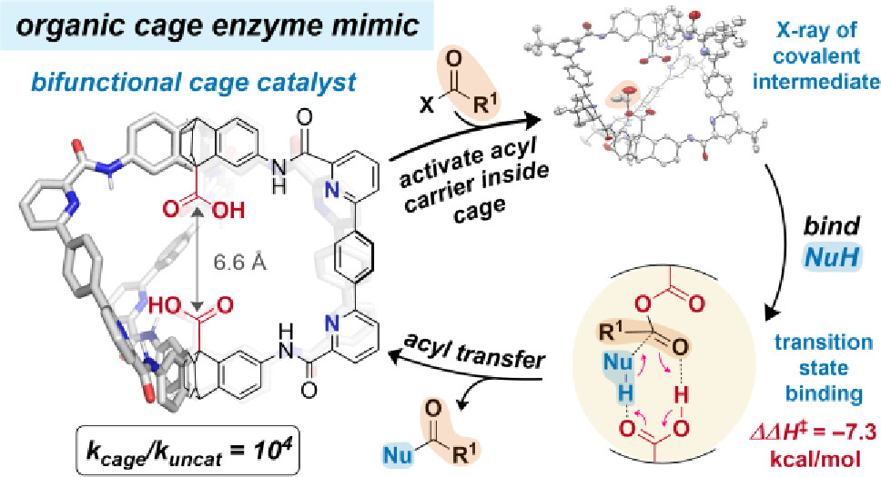
   </a>
   

    
10. Enzyme-like acyl transfer catalysis in a bifunctional organic cage

    
K. G. Andrews, <u> T.K. Piskorz</u>, P. N. Horton, S. J. Coles

    

      <a href="https://doi.org/10.1021/jacs.4c03560">J. Am. Chem. Soc. <b>2024</b>, 146, 17887</a>
    

   

  

  

   <a  href="https://doi.org/10.1039/d3sc02586a">
     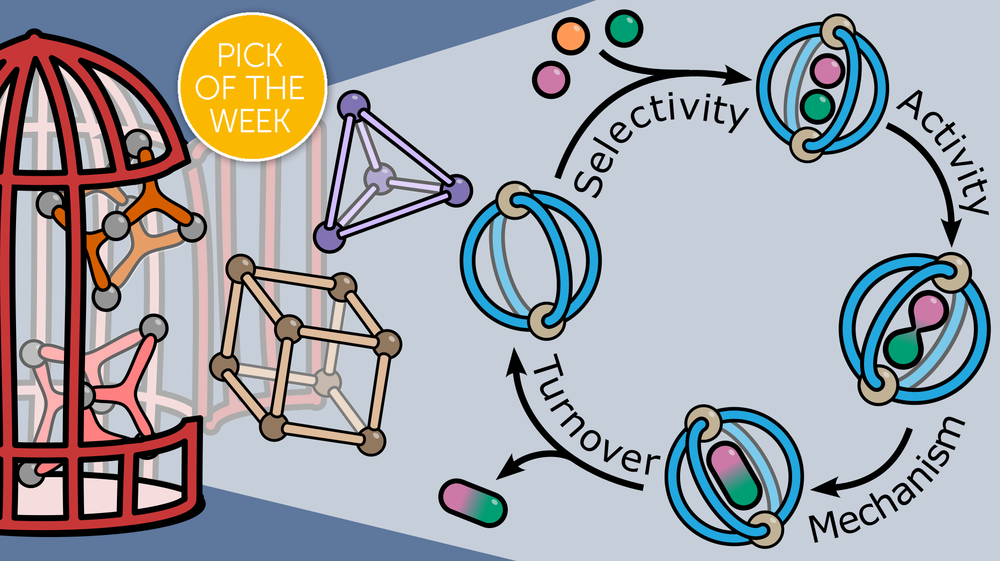
   </a>
   

    
9. Picking the Lock of Coordination Cage Catalysis

    
<u>T.K. Piskorz</u>, V. Martí Centelles, R. Spicer, F. Duarte, P. Lusby

    

      <a href="https://doi.org/10.1039/d3sc02586a">Chem. Sci. <b>2023</b>, 14, 11300</a>
    

   

  

  

   <a  href="https://doi.org/10.1021/acscatal.2c00837">
     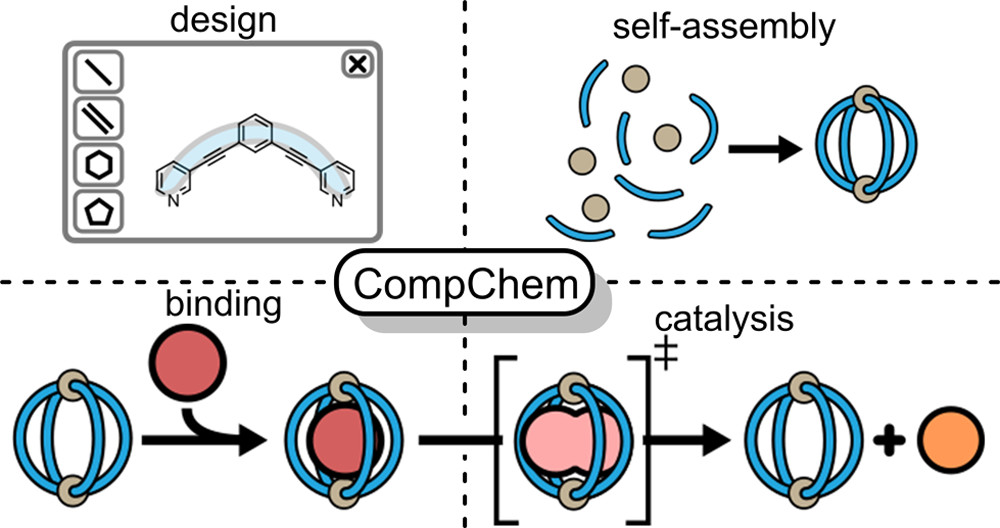
   </a>
   

    
8. Computational Modeling of Supramolecular Metallo-organic Cages-Challenges and Opportunities

    
<u>T.K. Piskorz,</u>, V. Martí-Centelles, T. A. Young, P. J. Lusby, F. Duarte

    

      <a href="https://doi.org/10.1021/acscatal.2c00837">ACS Catalysis, 2022, 5806</a>
    

   

  

  
  

   <a  href="https://doi.org/10.1021/acs.jctc.1c00257">
     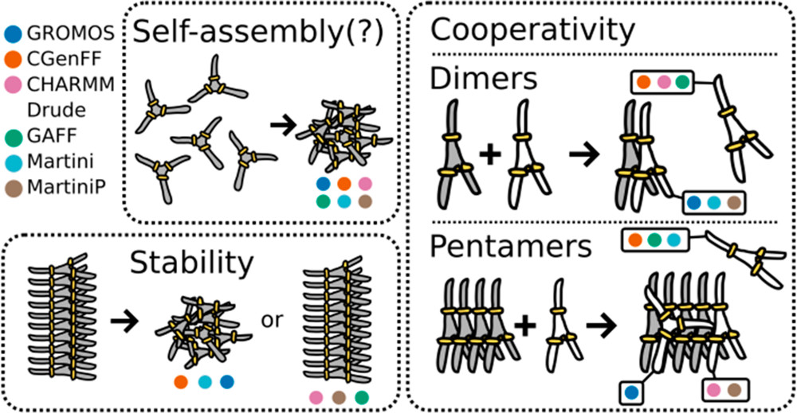
   </a>
   

    
7. How the Choice of Force-Field Affects the Stability and Self-Assembly Process of Supramolecular CTA Fibers

    
<u> T.K. Piskorz</u>, A. H. de Vries, J. H. van Esch

    

      <a href="https://doi.org/10.1021/acs.jctc.1c00257">J. Chem. Theory Comput. <b>2022</b>, 18(1), 431</a>
    

   

  

  

   <a  href="https://doi.org/10.1002/anie.202009701">
     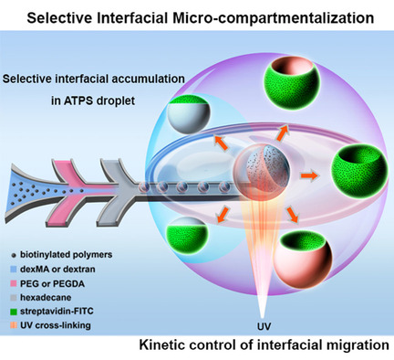
   </a>
   

    
6. Interfacial micro‐compartmentalization by kinetic control of selective interfacial accumulation

    
Q. Liu, Z. Yuan, M. Zhao, M. Huisman, G. Drewes, <u>T.K. Piskorz</u>, S. Mytnyk, G.J.M. Koper, E. Mendes, J.H. van Esch

    

      <a href="https://doi.org/10.1002/anie.202009701">Angew. Chem. Int. Ed. <b>2020</b>, 59, 23748</a>
    

   

  

  
  

   <a  href="https://doi.org/10.1002/advs.201902487">
     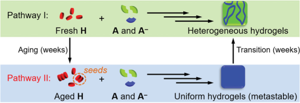
   </a>
   

    
5. Transient Supramolecular Hydrogels Formed by Aging‐Induced Seeded Self‐Assembly of Molecular Hydrogelators

    
Y. Wang, <u>T.K. Piskorz</u>, M. Lovrak, E. Mendes, X. Guo, R. Eelkema, J.H. van Esch

    

      <a href="https://doi.org/10.1002/advs.201902487">Adv. Sci. <b>2020</b>, 7, 1902487</a>
    

   

  

  

   <a  href="https://pubs.acs.org/doi/10.1021/acs.jpcc.9b01234">
     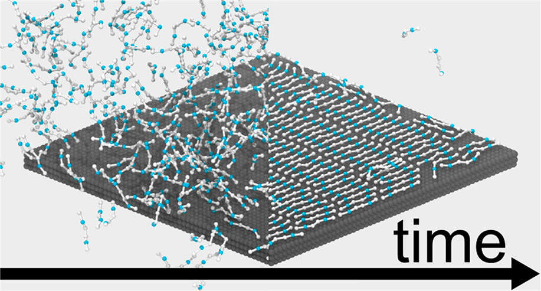
   </a>
   

    
4. Nucleation Mechanisms of Self-Assembled Physisorbed Monolayers on Graphite

    
<u>T.K. Piskorz</u>, C. Gobbo, S.J. Marrink, S. De Feyter, A.H. De Vries, J.H. van Esch

    

      <a href="https://pubs.acs.org/doi/10.1021/acs.jpcc.9b01234">J. Phys. Chem. C <b>2019</b>, 123, 28, 17510</a>
    

   

  

  
  

   <a  href="https://doi.org/10.1021/acs.jpcc.8b06432">
     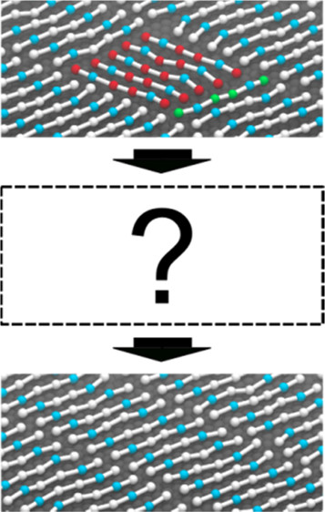
   </a>
   

    
3. Mechanism of Ostwald Ripening in 2D Physisorbed Assemblies at Molecular Time and Length Scale by Molecular Dynamics Simulations

    
<u>T.K. Piskorz</u>, A.H. de Vries, S. De Feyter, J. H. van Esch

    

      <a href="https://doi.org/10.1021/acs.jpcc.8b06432">J. Phys. Chem. C <b>2018</b>, 122, 42, 24380</a>
    

   

  

  
  

   <a  href="https://doi.org/10.1021/acs.langmuir.7b00428">
     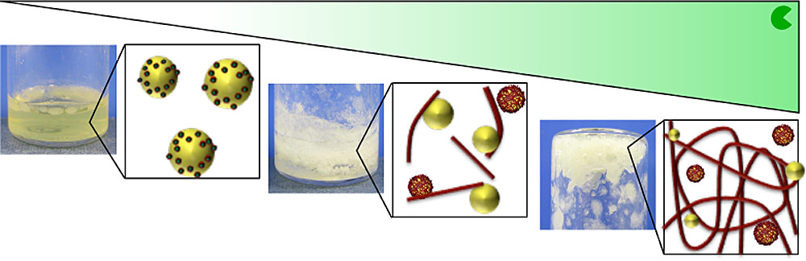
   </a>
   

    
2. Biocatalytic Self-Assembly of Tripeptide Gels and Emulsions

    
I.P. Moreira, <u>T.K. Piskorz</u>, J.H. van Esch, T. Tuttle, R.V. Ulijn

    

      <a href="https://doi.org/10.1021/acs.langmuir.7b00428">Langmuir <b>2017</b>, 33, 20, 4986</a>
    

   

  

  

   <a  href="https://doi.org/10.1021/jp502467u">
     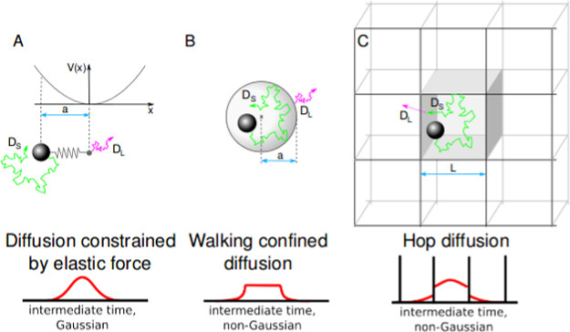
   </a>
   

    
1. A Universal Model of Restricted Diffusion for Fluorescence Correlation Spectroscopy

    
<u>T.K. Piskorz</u>, A. Ochab-Marcinek

    

      <a href="https://doi.org/10.1021/jp502467u">J. Phys. Chem. B <b>2014</b>, 118, 18, 4906</a>
    

   

  

  

